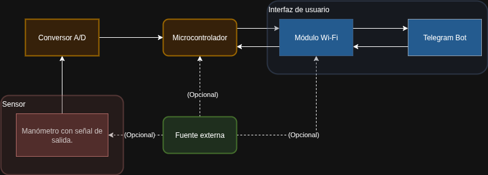

# Oxygen Tank Monitoring System

## Overview

The **Oxygen Tank Monitoring System** is an embedded software module designed to monitor the pressure levels of medical oxygen tanks in real time.  
It provides a user-friendly interface via a Telegram Bot, enabling configuration, monitoring, and alerts directly through a messaging platform.

This system is intended to run on STM32-based microcontrollers using the **Mbed OS** and integrates pressure sensors, a tank status evaluator, and WiFi-based communication.

---

## Features

- Reads analog pressure values from a gauge through the ADC.
- Determines tank state as `OK`, `LOW`, or `UNKNOWN`.
- Sends automatic alerts when the tank reaches low-pressure thresholds.
- Telegram Bot integration with support for commands such as:
  - `/start`, `/tank`, `/status`, `/gasflow`, `/setunit`, `/end`, etc.
- Supports both metric (bar) and imperial (psi) units.
- Handles multiple users and broadcasts alerts to all registered users.

---

## Project Structure

- **telegram_bot.h / telegram_bot_lib.h**: Logic for the Telegram Bot command parsing and messaging.
- **tank_monitor.h**: Tank monitoring core module, handles pressure readings and flow calculations.
- **pressure_gauge.h**: Reads pressure values using the analog interface.
- **wifi_com.h**: Communication with the Telegram API over WiFi (ESP-based module).
- **oxygen_monitor.h**: System-level integration point, manages state machine updates and timing.

---

## Supported Commands

| Command        | Description                                  |
|----------------|----------------------------------------------|
| `/start`       | Registers the user with the bot              |
| `/setunit`     | Sets measurement units (`BAR` or `PSI`)      |
| `/unit`        | Displays the currently selected unit         |
| `/newtank`     | Displays instructions to configure a new tank|
| `/tank`        | Registers a tank (by type or volume)         |
| `/status`      | Returns estimated time remaining             |
| `/newgf`       | Displays instructions to configure gas flow  |
| `/gasflow`     | Updates the tank’s current gas flow rate     |
| `/end`         | Unregisters the user                         |

---

## Units and Tank Factors

The system supports the following tank types:

- **D**, **E**, **M**, **G**, and **H**

Each tank type is associated with a factor (in L/bar or L/psi) used to estimate remaining oxygen time.  
You may also define a tank by volume directly.

---

## Dependencies

- [Mbed OS](https://os.mbed.com)
- [ArduinoJSON](https://arduinojson.org/)
- STM32 HAL and peripheral libraries
- ESP32 as a WiFi module
- Compatible analog pressure gauge (0.5–4.5V output range)

---

## Documentation

A more on depth documentation can be foud here (Spanish): [Link](https://docs.google.com/document/d/1Rf7b-09SAxiLqB1XF7JrPbkajfKJGvHUhdnzb8Eef8E/edit?usp=sharing)

Also, the code is documented using Doxygen so It's possible to run Doxygen with the `Doxyfile` included in `Doc` folder.

A video demostration of the system can be found [here (Spanish)](https://youtu.be/0VNFpdgWal4).

## Author

Developed by **Gonzalo Puy**  
August 2024